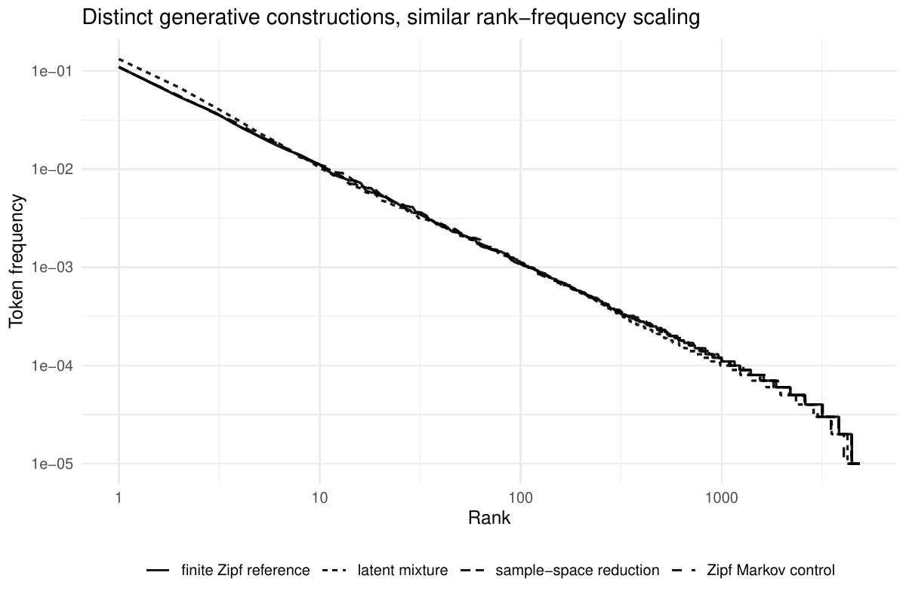
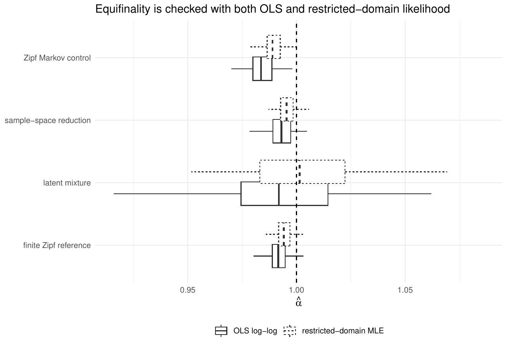
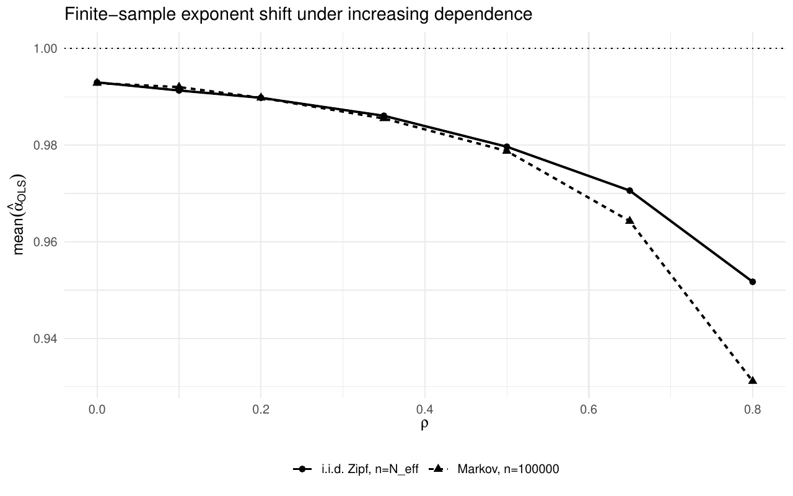
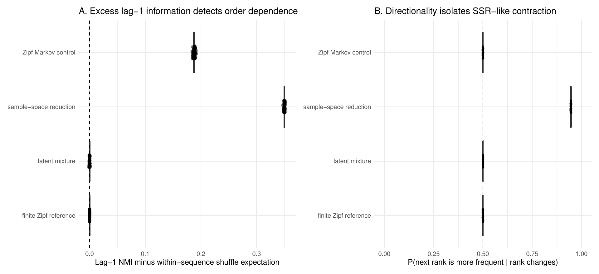
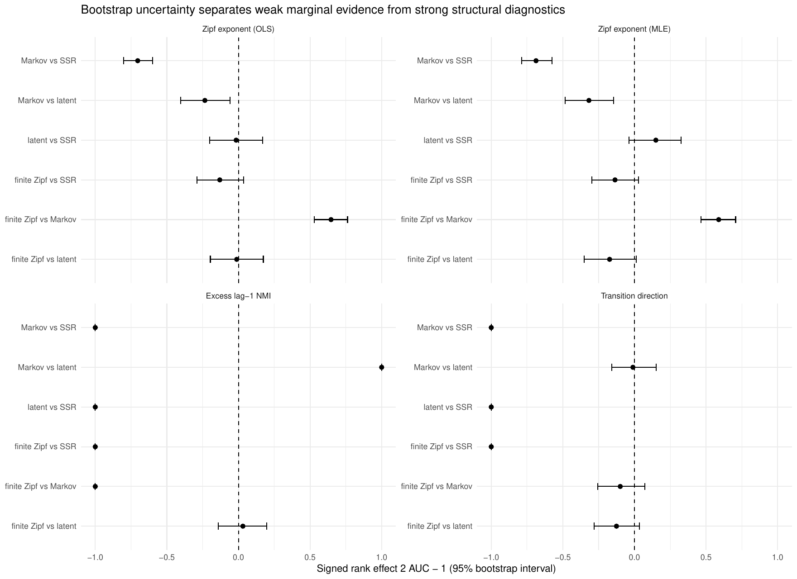
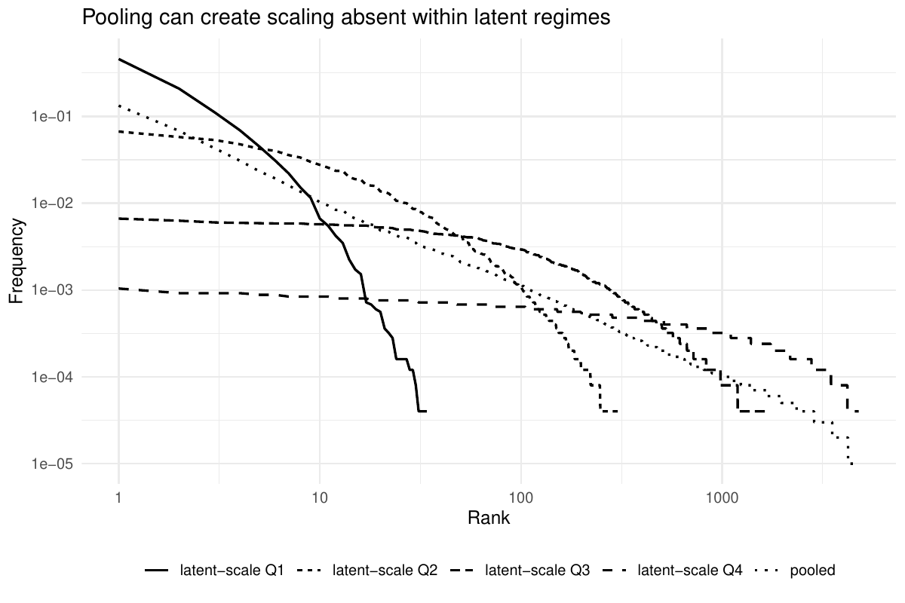
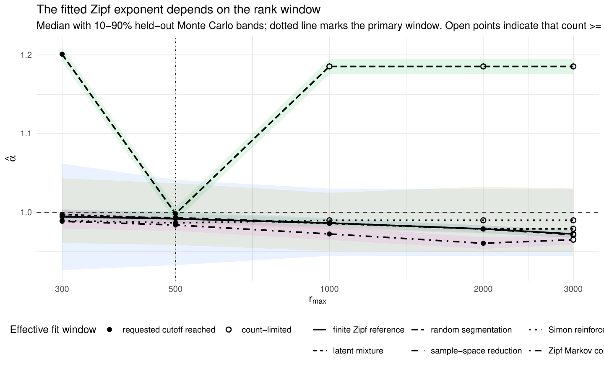
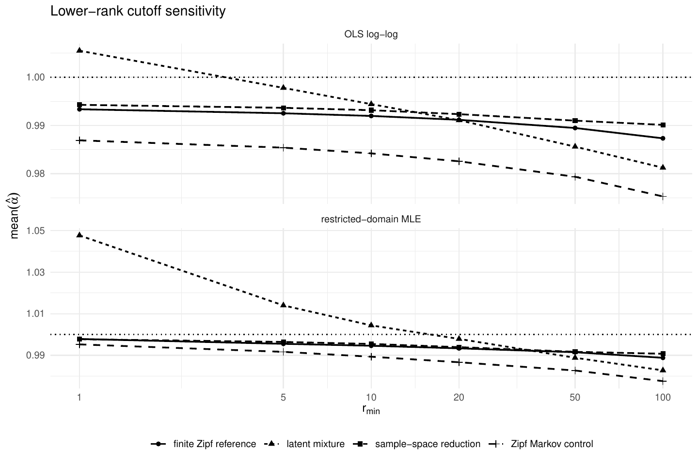
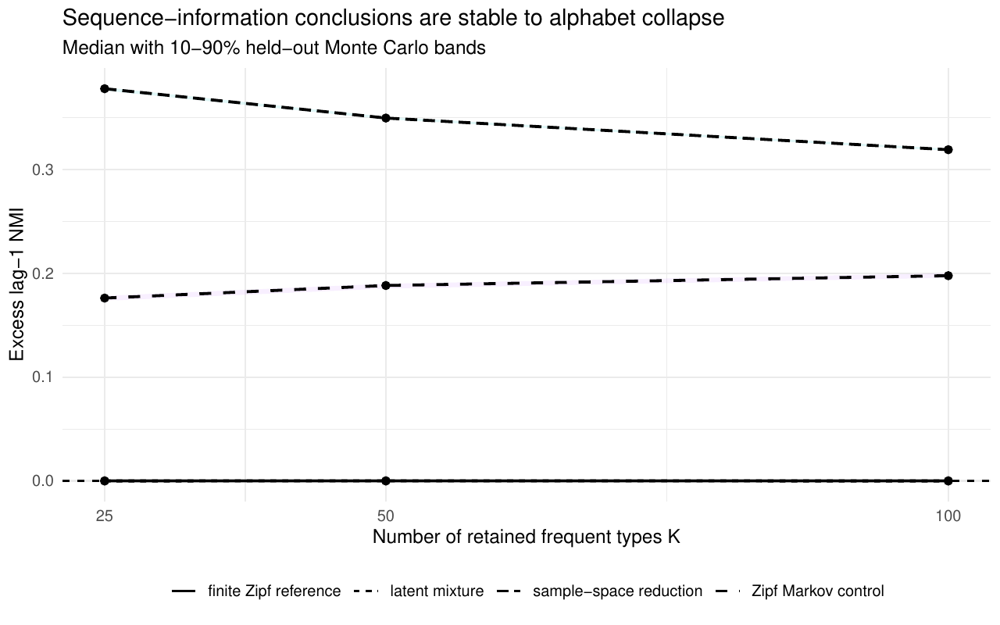
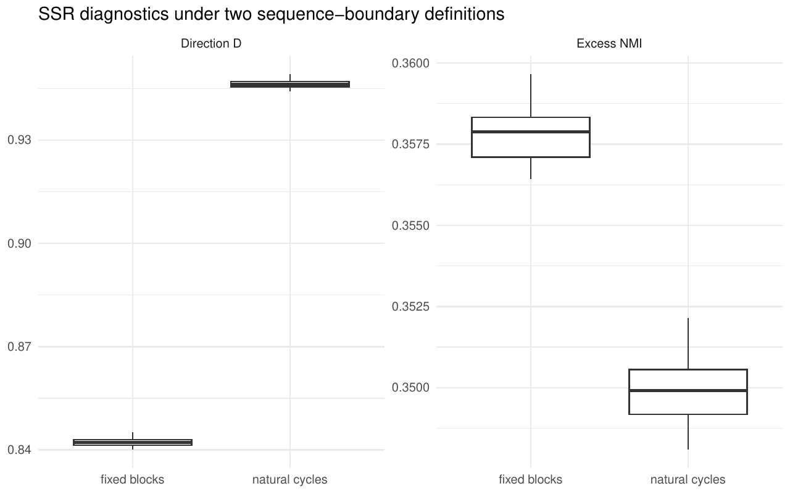

This page is the computational companion to *Beyond Zipf's Law: Equifinality and Mechanistic Inference from Scaling Laws*. It contains the generative constructions, calibration rules, held-out simulations and robustness checks used in the paper. No empirical whale or birdsong data are analysed here.

The central benchmark is deliberately controlled: an i.i.d. finite-Zipf process, a persistent Markov chain and canonical sample-space reduction (SSR) share the **same stationary marginal**,

$$
p_j=\frac{1}{jH_V},\qquad H_V=\sum_{k=1}^{V}\frac1k,
$$

but encode different sequence dynamics. A latent-scale mixture provides a separate construction in which pooling creates a Zipf-like marginal from non-Zipf conditional distributions.

::: {.callout-note title="Three ways to use this page"}
The default `analysis_mode: "precomputed"` renders the published numerical outputs quickly. Set `analysis_mode: "results"` to rebuild tables and figures from an existing `results/` directory. Set `analysis_mode: "recompute"` to rerun calibration, held-out simulations and robustness checks before rendering. The full run is intentionally slower; `quick: true` provides a short smoke test.
:::

```{r}
#| label: setup
parse_integer_vector <- function(x) {
  as.integer(trimws(strsplit(as.character(x), ",", fixed = TRUE)[[1L]]))
}
parse_numeric_vector <- function(x) {
  as.numeric(trimws(strsplit(as.character(x), ",", fixed = TRUE)[[1L]]))
}

analysis_mode <- match.arg(
  as.character(params$analysis_mode),
  c("precomputed", "results", "recompute")
)
live <- analysis_mode != "precomputed"

nmi_top_k_values <- parse_integer_vector(params$nmi_top_k_values)
rho_values <- parse_numeric_vector(params$rho_values)
r_min_values <- parse_integer_vector(params$r_min_values)
V <- as.integer(params$vocabulary_size)
L <- as.integer(params$block_size)

if (live) {
  required <- c("ggplot2", "patchwork", "knitr")
  missing <- required[!vapply(required, requireNamespace, logical(1), quietly = TRUE)]
  if (length(missing)) {
    stop("Install required packages first: ", paste(missing, collapse = ", "))
  }

  source("R/generators.R")
  source("R/diagnostics.R")
  source("R/calibration.R")
  source("R/figures.R")
  source("R/run_all.R")

  dir.create("figures", showWarnings = FALSE, recursive = TRUE)
  dir.create("results", showWarnings = FALSE, recursive = TRUE)
  dir.create("tables", showWarnings = FALSE, recursive = TRUE)
  set.seed(20260809)

  if (analysis_mode == "recompute") {
    if (isTRUE(params$quick)) {
      run_all(
        n_rep = 8L,
        n_cal_seeds = 3L,
        n_latent_cal_seeds = 8L,
        n_surrogates = 3L,
        n_boot = 250L,
        nmi_top_k_values = nmi_top_k_values,
        rho_values = unique(c(0, 0.35, 0.65)),
        r_min_values = unique(c(1L, 10L, 50L)),
        n_tokens = as.integer(params$n_tokens),
        vocabulary_size = V,
        block_size = L
      )
    } else {
      run_all(
        n_rep = as.integer(params$n_rep),
        n_cal_seeds = as.integer(params$n_cal_seeds),
        n_latent_cal_seeds = as.integer(params$n_latent_cal_seeds),
        n_surrogates = as.integer(params$n_surrogates),
        n_boot = as.integer(params$n_boot),
        nmi_top_k_values = nmi_top_k_values,
        rho_values = rho_values,
        r_min_values = r_min_values,
        n_tokens = as.integer(params$n_tokens),
        vocabulary_size = V,
        block_size = L
      )
    }
  }

  needed <- .paper_outputs("results")
  missing_results <- needed[!file.exists(needed)]
  if (length(missing_results)) {
    stop(
      "Missing simulation outputs: ", paste(missing_results, collapse = ", "),
      ". Use analysis_mode: recompute, or restore the results/ directory."
    )
  }
}

precomputed <- function(name) {
  utils::read.csv(file.path("tables", "precomputed", name), check.names = FALSE)
}

show_table <- function(x, caption = NULL, digits = 3L) {
  knitr::kable(x, format = "html", digits = digits, caption = caption)
}
```

# Reproducing the analysis

The repository separates model code from the rendered companion:

```text
R/generators.R      generative constructions
R/diagnostics.R     exponent, information and transition statistics
R/calibration.R     calibration and held-out replication helpers
R/figures.R         paper-facing figures
R/run_all.R         end-to-end simulation pipeline
results/            raw calibration, held-out and robustness outputs
figures/            paper-facing PDFs
tables/             CSV and LaTeX tables
index.qmd           this reproducibility companion
```

For a complete rerun in RStudio, either set

```yaml
analysis_mode: "recompute"
```

and render `index.qmd`, or use:

```r
source("RUN_IN_RSTUDIO.R")
```

The full analysis uses 100 held-out replications per primary construction, 20 shuffle surrogates for the excess-NMI null, and 2000 bootstrap resamples for pairwise AUC effects. Calibration and held-out seeds are disjoint.

# Generative benchmark

## Finite i.i.d. Zipf reference

Tokens are sampled independently from

$$
p(r;1,V)=\frac{r^{-1}}{\sum_{j=1}^{V}j^{-1}},\qquad V=5000.
$$

This process supplies a finite-Zipf reference. It is not used as a dynamical explanation.

## Sticky Markov control

Within blocks of length $L=250$, the transition kernel is

$$
P_{ij}=\rho\mathbf 1\{i=j\}+(1-\rho)p_j,
\qquad \rho=0.35.
$$

The chain is stationary under $p$ because

$$
\sum_i p_iP_{ij}=\rho p_j+(1-\rho)p_j\sum_i p_i=p_j.
$$

It is also reversible: for $i\neq j$, $p_iP_{ij}=p_jP_{ji}=(1-\rho)p_ip_j$. The control therefore contains serial dependence without a population preference for transitions toward more or less frequent ranks.

## Canonical sample-space reduction

For $i>1$, SSR moves uniformly to one of the lower states; after reaching state 1 it restarts uniformly over the full state space:

$$
P_{ij}=\frac{1}{i-1}\mathbf 1\{j<i\},\qquad
P_{1j}=\frac1V.
$$

The stationary distribution is again finite Zipf. If $\pi_j=(jH_V)^{-1}$,

$$
\begin{aligned}
(\pi P)_j
&=\frac{\pi_1}{V}+\sum_{i=j+1}^{V}\frac{\pi_i}{i-1}\\
&=\frac1{H_V}\left[\frac1V+\sum_{i=j+1}^{V}\frac1{i(i-1)}\right]\\
&=\frac1{jH_V}.
\end{aligned}
$$

SSR is therefore **not calibrated to the exponent**. The observed chain starts from stationarity; natural cycles between restarts define the primary sequence boundaries [@corominas2015; @thurner2015].

## Latent-scale mixture

Each realization contains 400 sequences of length 250. A scale $S_s$ is sampled once per sequence from a log-uniform distribution on $[0.5,8500]$. Conditional on $S_s=s$, ranks follow a truncated discrete-exponential law,

$$
P(R\le r\mid S_s=s)
=\frac{1-\exp(-r/s)}{1-\exp(-V/s)},
\qquad r=1,\ldots,V.
$$

The conditional laws are not Zipf. Pooling across scales creates the approximately Zipfian marginal [@schwab2014; @aitchison2016]. The scale range is the only primary parameter chosen numerically to target the fitted exponent.

```{r}
#| label: parameter-table
if (live) {
  cal_exp <- readRDS("results/calibration_exponent.rds")
  strict_parameters <- strict_benchmark_parameters(
    exponent_parameters = cal_exp$selected,
    n_tokens = as.integer(params$n_tokens),
    maxent_vocabulary_size = V,
    markov_vocabulary_size = V,
    markov_persistence = 0.35
  )
  strict_parameters$maxent$block_size <- L
  strict_parameters$markov$block_size <- L
  strict_parameters$ssr$vocabulary_size <- V
  strict_parameters$ssr$initial_distribution <- "stationary"

  latent_par <- strict_parameters$latent
  parameter_display <- data.frame(
    Construction = c(
      "finite Zipf reference", "Zipf Markov control",
      "sample-space reduction", "latent mixture"
    ),
    Status = c("fixed", "fixed", "fixed", "calibrated"),
    Parameters = c(
      paste0("V=", V, "; alpha=1; block length=", L),
      paste0("V=", V, "; alpha=1; rho=0.35; block length=", L),
      paste0("V=", V, "; stationary start; uniform restart"),
      paste0(
        latent_par$n_sequences, " sequences x ", latent_par$sequence_length,
        "; V=", latent_par$vocabulary_size,
        "; scale=[", signif(latent_par$scale_min, 5), ", ",
        signif(latent_par$scale_max, 5), "]"
      )
    )
  )
} else {
  parameter_display <- precomputed("primary_parameters.csv")
}
show_table(parameter_display, "Primary benchmark parameters.")
```

# Observation map and exponent summaries

The prespecified rank domain is

$$
10\le r\le500,\qquad N_{(r)}\ge5.
$$

The first summary is the negative OLS slope from regressing $\log\widehat p_{(r)}$ on $\log r$. It is retained as a deliberately compressed observer, not as a recommended stand-alone power-law test [@clauset2009].

A restricted-domain likelihood estimate uses the same empirically retained rank set $\mathcal R$:

$$
q_r(\alpha)=\frac{r^{-\alpha}}{\sum_{j\in\mathcal R}j^{-\alpha}},
$$

and

$$
\widehat\alpha_{\rm MLE}
=\arg\max_{\alpha>0}
\left[
-\alpha\sum_{r\in\mathcal R}N_{(r)}\log r
-N_{\mathcal R}\log\left(\sum_{j\in\mathcal R}j^{-\alpha}\right)
\right].
$$

The term *restricted-domain MLE* distinguishes truncation of the fitted rank set from conditioning on latent variables.

# Held-out results

```{r}
#| label: load-heldout
if (live) {
  rep_strict <- readRDS("results/benchmark_strict_replications.rds")
  rep_mimic <- readRDS("results/benchmark_mimicking_replications.rds")
  auc_boot <- utils::read.csv(
    "results/diagnostic_pairwise_auc_bootstrap_strict.csv",
    stringsAsFactors = FALSE
  )
  nmi_topk <- utils::read.csv(
    "results/nmi_topk_sensitivity_strict.csv",
    stringsAsFactors = FALSE
  )
  rmin_sens <- utils::read.csv(
    "results/alpha_rmin_sensitivity_strict.csv",
    stringsAsFactors = FALSE
  )
  rho_sens <- utils::read.csv(
    "results/markov_rho_sensitivity.csv",
    stringsAsFactors = FALSE
  )
  ssr_boundary <- utils::read.csv(
    "results/ssr_boundary_sensitivity.csv",
    stringsAsFactors = FALSE
  )

  sims_strict <- simulate_strict_benchmark_once(
    seed = 2001L,
    n_tokens = as.integer(params$n_tokens),
    parameters = strict_parameters
  )
}
```

## Same population marginal, similar rank curves

The i.i.d. reference and SSR remain nearly indistinguishable under the fitted exponent, while the latent mixture overlaps them despite being generated through aggregation. The Markov control has the same stationary marginal but a shifted finite-sample exponent distribution.

```{r}
#| label: fig-rank-frequency
#| fig-cap: "Held-out rank--frequency curves from three processes with the same finite-Zipf stationary marginal and a latent mixture with a similar pooled marginal."
#| fig-width: 8
#| fig-height: 5.2
if (live) {
  p_rank <- plot_rank_frequency(sims_strict)
  print(p_rank)
} else {
  
}
```

```{r}
#| label: fig-alpha-estimators
#| fig-cap: "Held-out exponent estimates under the OLS rank summary and the restricted-domain likelihood estimator."
#| fig-width: 8
#| fig-height: 5.5
if (live) {
  p_estimators <- plot_alpha_estimator_comparison(rep_strict)
  print(p_estimators)
} else {
  
}
```

```{r}
#| label: heldout-table
if (live) {
  strict_summary <- diagnostic_summary_table(rep_strict)
  get_diag <- function(g, v, field = "mean") {
    x <- strict_summary[
      strict_summary$generator == g & strict_summary$diagnostic == v,
      field
    ]
    if (!length(x)) NA_real_ else x[1L]
  }
  get_sd <- function(g, v) get_diag(g, v, "sd")
  fmt <- function(m, s, digits = 3L) {
    sprintf(paste0("%.", digits, "f (%.", digits, "f)"), m, s)
  }
  gs <- c(
    "finite Zipf reference", "Zipf Markov control",
    "sample-space reduction", "latent mixture"
  )
  heldout_display <- data.frame(
    Construction = gs,
    `OLS alpha` = vapply(gs, function(g) fmt(get_diag(g, "alpha"), get_sd(g, "alpha")), character(1)),
    `MLE alpha` = vapply(gs, function(g) fmt(get_diag(g, "alpha_mle"), get_sd(g, "alpha_mle")), character(1)),
    `Final V` = vapply(gs, function(g) fmt(get_diag(g, "vocabulary"), get_sd(g, "vocabulary"), 1L), character(1)),
    `Excess NMI` = vapply(gs, function(g) fmt(get_diag(g, "transition_nmi_excess"), get_sd(g, "transition_nmi_excess")), character(1)),
    `Direction D` = vapply(gs, function(g) fmt(get_diag(g, "transition_toward_more_frequent"), get_sd(g, "transition_toward_more_frequent")), character(1)),
    check.names = FALSE
  )
} else {
  heldout_display <- precomputed("heldout_summary.csv")
}
show_table(
  heldout_display,
  "Held-out diagnostics: mean (standard deviation) over 100 independent replications."
)
```

# Finite-sample effect of Markov dependence

Marginal equivalence does not imply equal sampling laws for nonlinear statistics. For any centered fixed function $f$, the Markov block satisfies

$$
\operatorname{Cov}\{f(X_t),f(X_{t+h})\}
=\rho^h\operatorname{Var}_p\{f(X)\}.
$$

For independent blocks of length $L$, the exact variance-inflation factor for a sample mean is

$$
\tau_L(\rho)
=1+2\sum_{h=1}^{L-1}\left(1-\frac{h}{L}\right)\rho^h,
$$

with effective-sample-size representation

$$
N_{\rm eff}=\frac{n}{\tau_L(\rho)}.
$$

At $\rho=0.35$, $L=250$ and $n=10^5$, this gives $N_{\rm eff}\simeq48{,}302$. This is an exact variance result for sample means of fixed functions, not an exact bias formula for the empirical-rank exponent estimator.

The expected realized vocabulary can also be calculated under the implemented block design. For a type with stationary probability $p_j$, absence from one block has probability

$$
(1-p_j)\{1-(1-\rho)p_j\}^{L-1}.
$$

For $B=n/L$ independent blocks,

$$
E[V_n]
=\sum_{j=1}^{V}
\left[
1-\left\{(1-p_j)[1-(1-\rho)p_j]^{L-1}\right\}^{B}
\right].
$$

At the primary parameters the theoretical expectation is 4598.9 observed types, close to the held-out mean of 4601.0.

```{r}
#| label: markov-theory-table
if (live) {
  theory_display <- data.frame(
    rho = 0.35,
    block_size = L,
    tau = markov_tau_block(0.35, L),
    n_eff = markov_effective_n(as.integer(params$n_tokens), 0.35, L),
    expected_V_iid = expected_vocabulary_iid(as.integer(params$n_tokens), V),
    expected_V_markov = expected_vocabulary_markov(
      as.integer(params$n_tokens), 0.35, V, 1, L
    )
  )
} else {
  theory_display <- precomputed("markov_theory.csv")
}
show_table(theory_display, "Finite-sample quantities implied by the Markov control.", digits = 2L)
```

The persistence sweep compares a Markov sample of size $n$ with an i.i.d. Zipf sample of size $N_{\rm eff}(\rho)$. The two fitted OLS exponents are close through moderate persistence and separate more clearly for large $\rho$; the effective-sample-size calculation is an explanation for much of the finite-sample shift, not an identity for the estimator bias.

```{r}
#| label: fig-markov-neff
#| fig-cap: "Finite-sample exponent shift as Markov persistence increases. The i.i.d. comparison uses the block-adjusted effective sample size."
#| fig-width: 8
#| fig-height: 5.2
if (live) {
  rho_groups <- split(rho_sens, rho_sens$rho)
  rho_summary <- do.call(rbind, lapply(rho_groups, function(d) {
    data.frame(
      rho = d$rho[1L],
      markov_alpha = mean(d$markov_alpha, na.rm = TRUE),
      iid_neff_alpha = mean(d$iid_neff_alpha, na.rm = TRUE)
    )
  }))
  rho_long <- rbind(
    data.frame(rho = rho_summary$rho, alpha = rho_summary$markov_alpha, estimator = "Markov, n=100000"),
    data.frame(rho = rho_summary$rho, alpha = rho_summary$iid_neff_alpha, estimator = "i.i.d. Zipf, n=N_eff")
  )
  p_rho <- ggplot2::ggplot(
    rho_long,
    ggplot2::aes(x = rho, y = alpha, linetype = estimator, shape = estimator)
  ) +
    ggplot2::geom_line(linewidth = 0.8) +
    ggplot2::geom_point(size = 2) +
    ggplot2::geom_hline(yintercept = 1, linetype = 3) +
    ggplot2::labs(x = expression(rho), y = expression(mean(hat(alpha)[OLS])), linetype = NULL, shape = NULL) +
    ggplot2::theme_minimal(base_size = 11) +
    ggplot2::theme(legend.position = "bottom")
  print(p_rho)
} else {
  
}
```

# Sequence structure

The marginal comparison discards order. We use two statistics to retain it.

For the $K$ most frequent types plus an `OTHER` category,

$$
I_{\rm NMI}(X;Y)=\frac{I(X;Y)}{\sqrt{H(X)H(Y)}},
$$

and

$$
I_{\rm excess}(K)
=I_{\rm NMI}^{(K)}(X_t;X_{t+1})
-E_{\rm shuffle}\left[I_{\rm NMI}^{(K)}(X_t;X_{t+1})\right].
$$

The default uses $K=50$ and 20 independently shuffled surrogates within each sequence. Positive $I_{\rm excess}$ indicates order information relative to this null; it does not identify the form of the dependence.

Direction is measured separately by

$$
D=P(R_{t+1}<R_t\mid R_{t+1}\neq R_t),
$$

where $R_t$ is the global empirical frequency rank. Reversibility gives $D=1/2$ for the Markov control in population. Strong within-cycle directionality is built into canonical SSR, so its large $D$ is a prespecified positive control rather than a discovered signature.

```{r}
#| label: fig-sequence-diagnostics
#| fig-cap: "Excess lag-1 information detects order dependence; transition direction separates reversible Markov persistence from the directional contraction built into canonical SSR."
#| fig-width: 11
#| fig-height: 5.4
if (live) {
  p_sequence <- plot_sequence_diagnostic_figure(rep_strict)
  print(p_sequence)
} else {
  
}
```

Pairwise rank effects make the contrast explicit. Exponent effects between the i.i.d. reference, latent mixture and SSR are weak, whereas order information separates sequential from exchangeable constructions and $D$ separates SSR from the other models in this controlled design. The effects are univariate AUC summaries, not distances between model distributions.

```{r}
#| label: fig-bootstrap-effects
#| fig-cap: "Signed AUC rank effects with 95% bootstrap intervals for the two exponent summaries and the two sequence diagnostics."
#| fig-width: 10
#| fig-height: 7.3
if (live) {
  p_boot <- plot_bootstrap_selected_diagnostics(auc_boot)
  print(p_boot)
} else {
  
}
```

# Aggregation in the latent mixture

The latent-scale construction is exchangeable conditional on sequence-specific scale. Its relevant diagnostic is therefore conditioning rather than transition direction. Pooling produces an approximately Zipfian marginal even though the scale-conditioned distributions are not Zipf laws.

```{r}
#| label: fig-latent-conditioning
#| fig-cap: "Pooling across latent scales creates marginal scaling that is absent within scale-conditioned regimes."
#| fig-width: 7.5
#| fig-height: 5.2
if (live) {
  p_latent <- plot_latent_conditioning(sims_strict$latent)
  print(p_latent)
} else {
  
}
```

This example is a controlled illustration of aggregation. Conditioning need not weaken Zipf scaling in every empirical system; it does so here because the data-generating construction was designed around latent scale heterogeneity.

# Observation-design sensitivity

## Upper-rank cutoff

Random segmentation and Simon reinforcement are kept outside the primary exact-marginal comparison. Their role is to show how the fitted exponent can depend on the observation window [@simon1955; @li1992; @conrad2004; @ferrerElvevag2010]. Generator parameters are fixed while the requested upper rank varies over

$$
r_{\max}\in\{300,500,1000,2000,3000\}.
$$

Random segmentation passes through a near-one OLS exponent at the primary window and moves far from one at other cutoffs; Simon reinforcement remains closer to one over the same range.

```{r}
#| label: fig-rmax
#| fig-cap: "Sensitivity of the fitted OLS exponent to the requested upper-rank cutoff. Open points mark fits truncated earlier by the minimum-count rule."
#| fig-width: 9
#| fig-height: 5.4
if (live) {
  strict_sens <- utils::read.csv("results/alpha_sensitivity_strict_replications.csv", stringsAsFactors = FALSE)
  mimic_sens <- utils::read.csv("results/alpha_sensitivity_mimicking_replications.csv", stringsAsFactors = FALSE)
  p_rmax <- plot_alpha_sensitivity(rbind(strict_sens, mimic_sens), primary_r_max = 500L)
  print(p_rmax)
} else {
  
}
```

## Lower-rank cutoff

The lower cutoff varies over

$$
r_{\min}\in\{1,5,10,20,50,100\},
$$

with $r_{\max}=500$ and the count threshold unchanged. The most visible sensitivity occurs for the latent mixture: its mean restricted-domain estimate declines from 1.048 at $r_{\min}=1$ to 1.004 at $r_{\min}=10$ and 0.998 at $r_{\min}=20$, reflecting curvature in the head of the pooled distribution.

```{r}
#| label: fig-rmin
#| fig-cap: "Sensitivity of OLS and restricted-domain exponent estimates to the lower-rank cutoff."
#| fig-width: 9
#| fig-height: 6
if (live) {
  key <- interaction(rmin_sens$generator, rmin_sens$r_min, drop = TRUE)
  rmin_summary <- do.call(rbind, lapply(split(seq_len(nrow(rmin_sens)), key), function(idx) {
    d <- rmin_sens[idx, , drop = FALSE]
    data.frame(
      generator = d$generator[1L],
      r_min = d$r_min[1L],
      alpha = mean(d$alpha, na.rm = TRUE),
      alpha_mle = mean(d$alpha_mle, na.rm = TRUE)
    )
  }))
  rmin_long <- rbind(
    data.frame(generator = rmin_summary$generator, r_min = rmin_summary$r_min, alpha = rmin_summary$alpha, estimator = "OLS log-log"),
    data.frame(generator = rmin_summary$generator, r_min = rmin_summary$r_min, alpha = rmin_summary$alpha_mle, estimator = "restricted-domain MLE")
  )
  p_rmin <- ggplot2::ggplot(
    rmin_long,
    ggplot2::aes(x = r_min, y = alpha, linetype = generator, shape = generator)
  ) +
    ggplot2::geom_line(linewidth = 0.75) +
    ggplot2::geom_point(size = 1.8) +
    ggplot2::geom_hline(yintercept = 1, linetype = 3) +
    ggplot2::facet_wrap(~ estimator, ncol = 1, scales = "free_y") +
    ggplot2::scale_x_log10(breaks = sort(unique(rmin_long$r_min))) +
    ggplot2::labs(x = expression(r[min]), y = expression(mean(hat(alpha))), linetype = NULL, shape = NULL) +
    ggplot2::theme_minimal(base_size = 11) +
    ggplot2::theme(legend.position = "bottom")
  print(p_rmin)
} else {
  
}
```

# Robustness of the sequence diagnostics

## Alphabet collapse

The excess-NMI calculation is repeated for $K\in\{25,50,100\}$. The ordering is stable over these choices: i.i.d. and latent mixture remain near zero, Markov lies around 0.18--0.20, and SSR remains higher at roughly 0.32--0.38.

```{r}
#| label: fig-nmi-topk
#| fig-cap: "Excess lag-1 NMI under three alphabet-collapse choices."
#| fig-width: 8
#| fig-height: 5
if (live) {
  p_nmi <- plot_nmi_sensitivity(nmi_topk)
  print(p_nmi)
} else {
  
}
```

## SSR sequence boundaries

The primary SSR analysis excludes restart transitions because `sequence_id` marks natural cycles. To assess the dependence on this choice, the same realizations are relabelled into fixed blocks of 250 tokens. Excess NMI changes only slightly, from 0.350 to 0.358 on average. Direction falls from 0.946 to 0.842 because restart transitions can now occur inside an observational block. The qualitative asymmetry remains under both boundary definitions.

```{r}
#| label: fig-ssr-boundaries
#| fig-cap: "SSR diagnostics under natural cycles and fixed 250-token blocks."
#| fig-width: 8
#| fig-height: 5
if (live) {
  ssr_long <- rbind(
    data.frame(statistic = "Excess NMI", boundary = "natural cycles", value = ssr_boundary$transition_nmi_excess_natural),
    data.frame(statistic = "Excess NMI", boundary = "fixed blocks", value = ssr_boundary$transition_nmi_excess_fixed),
    data.frame(statistic = "Direction D", boundary = "natural cycles", value = ssr_boundary$D_natural),
    data.frame(statistic = "Direction D", boundary = "fixed blocks", value = ssr_boundary$D_fixed)
  )
  p_ssr <- ggplot2::ggplot(ssr_long, ggplot2::aes(x = boundary, y = value)) +
    ggplot2::geom_boxplot(outlier.shape = NA) +
    ggplot2::facet_wrap(~ statistic, scales = "free_y") +
    ggplot2::labs(x = NULL, y = NULL) +
    ggplot2::theme_minimal(base_size = 11)
  print(p_ssr)
} else {
  
}
```

# Calibration

The exact-Zipf i.i.d., Markov and SSR constructions are fixed analytically. Calibration is reserved for the latent mixture and for the random-segmentation and Simon controls used in the observation-window exercise. Calibration seeds begin at 1001. The primary held-out benchmark begins at seed 2001. No held-out sequence diagnostic is used to select a model parameter.

The latent range is chosen in two stages: a coarse search followed by a 50-seed final panel. Candidates are ranked by the absolute deviation of the mean OLS exponent from one, with RMSE and Monte Carlo standard deviation used as tie-breakers.

```{r}
#| label: calibration-table
if (live) {
  cal_display <- utils::read.csv("results/calibration_exponent_summary.csv", stringsAsFactors = FALSE)
} else {
  cal_display <- precomputed("calibration_summary.csv")
}
show_table(cal_display, "Calibration summaries for the tunable constructions.", digits = 3L)
```

# What this benchmark does and does not identify

The controlled comparison establishes four distinct facts.

1. **Marginal equivalence can be exact.** The i.i.d., Markov and SSR processes share $p_j=(jH_V)^{-1}$ without numerical tuning.
2. **A fitted marginal statistic can still differ in finite samples.** Markov dependence changes the sampling distribution of $\widehat\alpha$ despite leaving the stationary marginal unchanged.
3. **Order supplies information discarded by the rank distribution.** $I_{\rm excess}$ separates exchangeable from sequential processes in the benchmark; $D$ then separates reversible persistence from the directional contraction built into canonical SSR.
4. **A similar marginal can arise by aggregation.** In the latent mixture, conditioning on scale exposes non-Zipf conditional structure hidden by pooling.

These statements are about the specified generators and observation designs. They do not imply that $I_{\rm excess}$ or $D$ uniquely identifies a mechanism in empirical communication data, or that conditioning must weaken Zipf scaling in other systems. The animal-communication discussion in the paper treats these diagnostics as prospective contrasts, not as an empirical reanalysis.

# Files generated by a full run

```text
results/
  benchmark_strict_replications.{csv,rds}
  benchmark_mimicking_replications.{csv,rds}
  diagnostic_pairwise_auc_bootstrap_strict.csv
  nmi_topk_sensitivity_strict.csv
  alpha_sensitivity_strict_replications.csv
  alpha_sensitivity_mimicking_replications.csv
  alpha_rmin_sensitivity_strict.csv
  markov_rho_sensitivity.csv
  ssr_boundary_sensitivity.csv
  calibration_exponent.rds
  calibration_exponent_summary.csv
  strict_alpha_status.csv

figures/
  fig_rank_frequency_v060.pdf
  fig_alpha_estimator_robustness_v060.pdf
  fig_sequence_identification_v060.pdf
  fig_bootstrap_key_diagnostics_v060.pdf
  fig_markov_neff_v060.pdf
  fig_alpha_rmax_sensitivity_v060.pdf
  fig_alpha_rmin_sensitivity_v060.pdf
  fig_nmi_topk_sensitivity_v060.pdf
  fig_ssr_boundary_sensitivity_v060.pdf
  fig_latent_conditioning_v060.pdf
```

# Computational environment

```{r}
#| label: session-info
if (live) {
  sessionInfo()
} else {
  cat("The online/precomputed render does not rerun the R pipeline.\n")
  cat("Use analysis_mode: results or analysis_mode: recompute to print the local sessionInfo().\n")
}
```

# References
